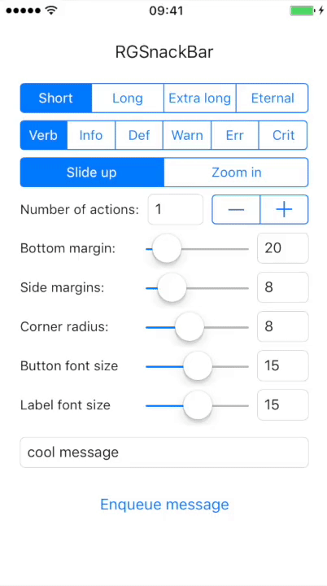
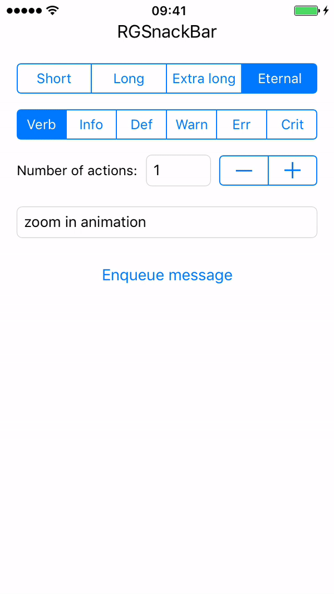

# RGSnackBar

[](https://travis-ci.org/jdarowski/RGSnackBar)
[](http://cocoapods.org/pods/RGSnackBar)
[](http://cocoapods.org/pods/RGSnackBar)
[](http://cocoapods.org/pods/RGSnackBar)

## About

 

This library was created during the development of one of 
[Reality Games'](https://wearerealitygames.com/) games out of need. It has all
the features I needed during development and plenty of room for extensions

## Requirements

* Swift 2.3
* iOS 9.3

For now RGSnackBar runs on Swift 2.3 as that's what I personally need, but it
will be migrated to Swift 3 and later Swift 4 when needed.

The target platform is iOS 9.0, but I have tested it on 9.3 only, so please be careful

## Installation

RGSnackBar is available through [CocoaPods](http://cocoapods.org). To install
it, simply add the following line to your Podfile:

```ruby
pod "RGSnackBar"
```
## Usage

Basically you'll need an `RGMessageQueue` with some kind of `RGMessagePresenter`. **How** you decide to do it is completely up to you. This lib comes with two presenters: `RGMessageConsolePresenter` and `RGMessageSnackBarPresenter`, but I **strongly** encourage you to write your own presenters for anything you like. Perhaps a system-banner like presentation? Who knows? Only you. ( ͡° ͜ʖ ͡° ) 

## Features

* Prioritized messages thanks to [SwiftPriorityQueue](https://github.com/davecom/SwiftPriorityQueue)
* Easy and dynamic layout for `RGSnackBarPresenter` thanks to [Stevia](https://github.com/freshOS/Stevia)
* Completely customizable animations for `RGSnackBarView` with _slide up_ and _zoom in_ already made
* Base class `RGMessageView` for endless possibilities - want a snack bar? Here! Want a banner? Make one!

## Example

To run the example project, clone the repo, and run `pod install` from the Example directory first.

## Author

[Me](https://github.com/jdarowski/), a Senior iOS Developer at 
[Reality Games](https://wearerealitygames.com/). 

## Changelog

* 0.1
    * Initial release
* 0.2
    * Easier styling
    * Better example

## Contributing

Feel free to fork this repository, make your changes and create a pull request.
Your additions are very welcome! 😉

## License

RGSnackBar is available under the MIT license. See the LICENSE file for more info.
